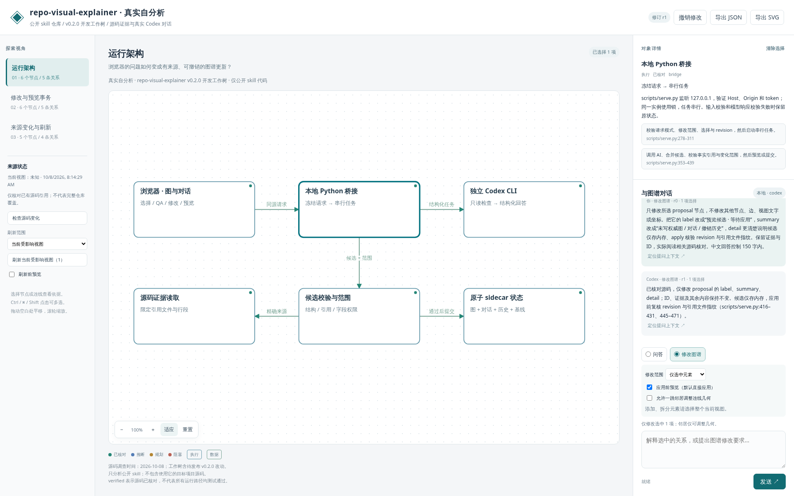
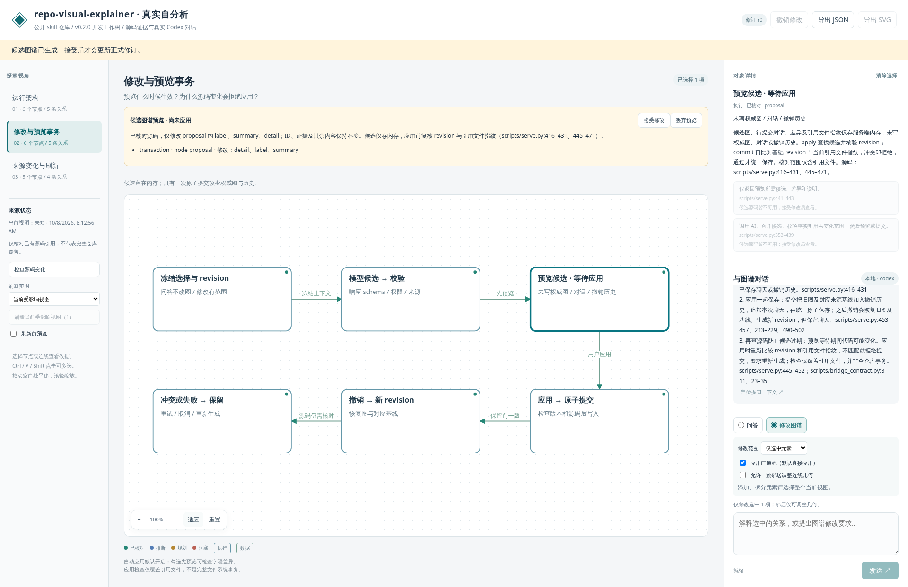

# Repository Visual Explainer

一个用于理解代码仓库的 Codex skill：生成有源码证据的多视图关系图，在浏览器中选中节点或连线，向 AI 提问，或让 AI 更新图和说明。

开发与发布仓库：[Hash012/repo-visual-explainer](https://github.com/Hash012/repo-visual-explainer)。Skill 入口是 [SKILL.md](SKILL.md)。

## 两个版本下载

| 版本 | 固定下载入口 | 用途 |
| --- | --- | --- |
| 改进前 · v0.1.0 | [下载 ZIP](https://github.com/Hash012/repo-visual-explainer/releases/download/v0.1.0/repo-visual-explainer-v0.1.0.zip) | 保留原有行为和 UI，独立安装或对照 |
| 改进后 · v0.2.0 | [下载 ZIP](https://github.com/Hash012/repo-visual-explainer/releases/download/v0.2.0/repo-visual-explainer-v0.2.0.zip) | 修改范围约束、可选预览、来源变化检测与避障连线 |

两个包都只包含通用 skill。发行标签固定，下载包不会随 `main` 更新。解压后的 `repo-visual-explainer/` 即 skill 目录；只安装其中一个版本，避免重复发现。

新版 sidecar 保存来源基线；降级使用新版迁移时保存的 v1 备份，并保留新版状态的副本。不要直接让旧服务读取新版 sidecar。具体步骤见 [运行说明](references/runtime.md)。

## 界面预览

以下截图来自新版 skill 对本公开仓库 `Hash012/repo-visual-explainer` 自身的真实源码分析：运行架构、修改事务和来源刷新共三个视图，节点与关系附相对路径及行号。问答、局部修改和预览使用真实 Codex CLI 响应，不使用预设回答。

截图基于 v0.2.0 发布前的开发工作树；不展示任何其他项目的代码或私有资料。图谱初始来源状态为「未知」，直到显式刷新建立核对基线，不能把截图中的核对说明视为全仓库运行验证。

### 仓库运行架构

总览把浏览器、Python 桥接、独立 Codex CLI、来源读取、候选校验和原子状态串联起来；细节视图展开预览事务及来源刷新。



### 仅问答

左侧切换视图，中间选择节点或连线，右侧查看职责、源码引用和对话。问答模式解释所选部分，保持图数据不变。


### 修改可视化

选择修改范围后，针对问题更新图与说明。局部修改只允许所选元素及明确授权的邻居移动；拆解步骤或新增视图需选择整个视图范围。默认自动应用，也可先预览差异再应用；可撤销修改。



应用后，候选成为当前图谱；对话与修订同步保存。


## 功能

| 能力 | 行为 |
| --- | --- |
| 多视图关系图 | 从端到端总览展开调用、数据、状态、生命周期与失败路径，按仓库实际复杂度选取视图 |
| 源码证据 | 节点和重要关系引用仓库相对路径与行段，区分已核对、推断、规划和阻塞 |
| 元素选择 | 节点与连线可点击、键盘选择和多选；跨视图链接定位具体元素 |
| 仅问答 | 浏览器显示 AI 回答，服务拒绝问答响应中的图修改 |
| 修改可视化 | 服务端校验选择范围，拒绝越权修改；可选差异预览、应用或取消，支持撤销 |
| 来源变化 | 按视图记录引用文件 SHA-256，提示变化、缺失或未核对；仅刷新选定视图 |
| 连线与文字 | 有界正交避障，保留有效手工路由；按浏览器字体换行，拥挤时提示拆图 |
| 导航与导出 | 平移、缩放、适配画布、深链接、刷新恢复，导出当前 SVG 与图谱 JSON |

质量标准见 [references/quality.md](references/quality.md)。图的事实与可读性仍需按源码和实际界面复核；结构校验不替代事实验证。

## 安装与使用

运行环境：Linux/macOS 等 POSIX 系统、Python 3.10+、浏览器，以及已安装并登录的 Codex CLI。页面服务使用 Python 标准库，无需 npm、pip 或 CDN。当前桥接依赖 CLI 的 `--ignore-user-config` 等参数，兼容要求见 [运行说明](references/runtime.md)。

把仓库克隆到个人 skills 目录；已有同名目录时先确认其用途，不要覆盖自己的改动：

```bash
skill_root="${CODEX_HOME:-$HOME/.codex}/skills"
mkdir -p "$skill_root"
git clone https://github.com/Hash012/repo-visual-explainer.git "$skill_root/repo-visual-explainer"
```

重新打开 Codex 会话，在需要理解的目标仓库中请求：

```text
使用 $repo-visual-explainer 为当前仓库生成可交互关系图。
重点说明入口、数据流、状态变化和失败路径，并打开浏览器。
```

Skill 会调查代码、制作 `atlas.json`、核对来源并启动本地服务。进入页面后选择元素，切换「问答」或「修改图谱」，输入问题并发送。Ctrl / ⌘ / Shift 点击可多选。修改前可选择「选中元素」或「整个视图」，勾选「先预览」查看候选图和逐项差异。源码变更后使用「检查来源」及「刷新视图」。

浏览器通过独立 Codex CLI 任务获得回答，不自动连接到发起 skill 的原始聊天线程。修改模式更新可视化与说明，不编辑目标仓库源码。

已有图谱时也可手动启动；请替换下面三个绝对路径，图谱输出目录放在目标仓库外：

```bash
python3 /path/to/repo-visual-explainer/scripts/validate_atlas.py \
  /path/to/output/atlas.json --repo /path/to/target-repo
python3 /path/to/repo-visual-explainer/scripts/serve.py \
  --repo /path/to/target-repo --atlas /path/to/output/atlas.json --open
```

使用服务打印的 `http://127.0.0.1:<port>/` 地址；直接打开 HTML 文件无法聊天。无桌面或远程环境中按 [运行说明](references/runtime.md) 转发同一端口。终端 Ctrl+C 停止服务。

## 数据与维护边界

本仓库维护通用 skill、浏览器资源、运行脚本与文档。目标仓库的源码、实例图谱、聊天记录和历史版本不应提交到这里。README 截图仅展示本公开 skill 的自分析。v0.1.0 发行包保留其原有合成示例截图和说明。

服务仅监听本机回环地址，源码查看接口限制为图谱已有引用的文件行段。AI 任务使用 Codex 的 read-only 写入隔离；只读目标仓库的范围是任务指令，并非操作系统级读取封锁。实例上下文会交给所用模型处理，具体边界见 [运行说明](references/runtime.md)。

`atlas.json` 是初始图谱；运行后相邻的 `atlas.json.bridge-state.json` 保存当前图、最近对话及撤销历史。导出按钮获得当前图谱，不应把初始文件误认为更新后的版本。

## 开发与验证

| 目录或文件 | 职责 |
| --- | --- |
| [SKILL.md](SKILL.md)、[agents/openai.yaml](agents/openai.yaml) | Skill 工作流与发现信息 |
| [assets/](assets/) | 浏览器界面与图谱/响应 schema |
| [scripts/](scripts/) | 本地服务、图谱校验与回归测试 |
| [references/](references/) | 质量标准、数据契约和运行约束 |
| [docs/images/](docs/images/) | 本公开仓库真实自分析的 UI 截图 |

在独立开发检出中运行：

```bash
python3 scripts/test_bridge.py
node --check assets/app.js
node scripts/test_routing.js
python3 scripts/test_upgrade.py
```

Node 仅用于开发时的 JavaScript 语法检查，不是运行服务的依赖。回归覆盖问答不改图、修改范围、预览事务、来源变化与失效恢复、版本冲突、持久化、撤销和实例互斥。路由对照方法和可复现验收见 [评估说明](references/evaluation.md)。测试使用临时合成仓库，不替代真实模型的事实核对。
